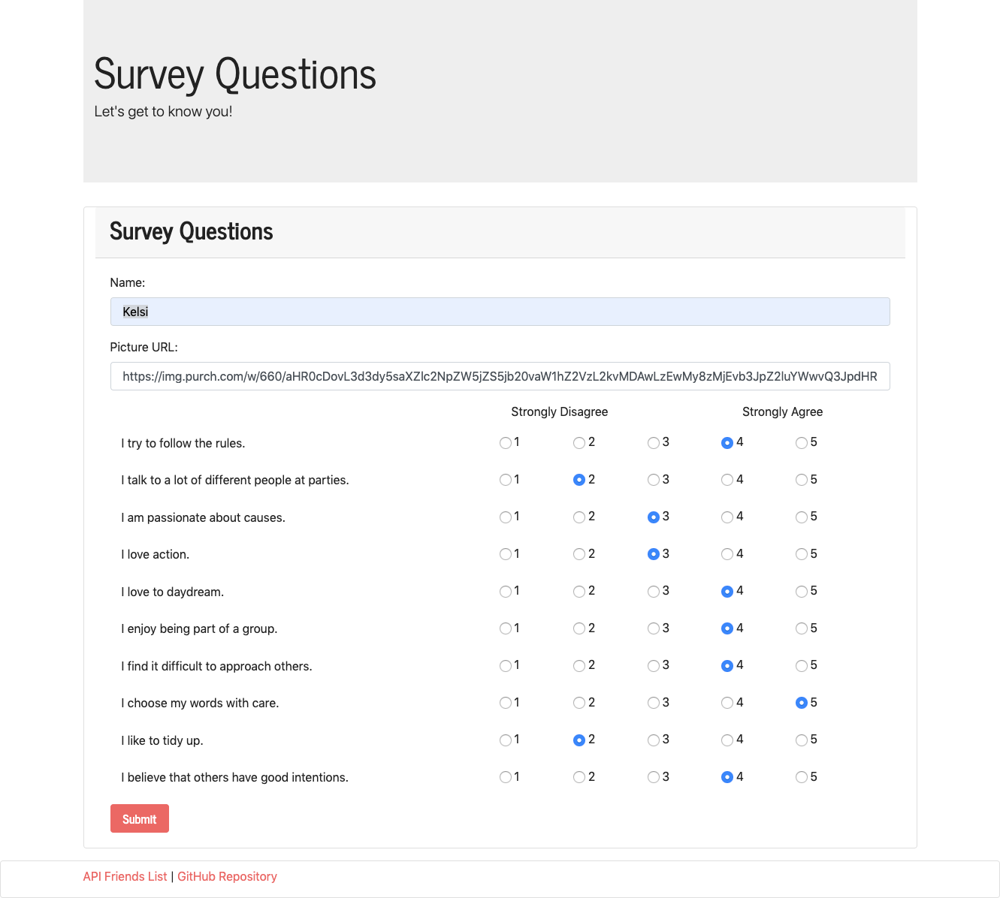
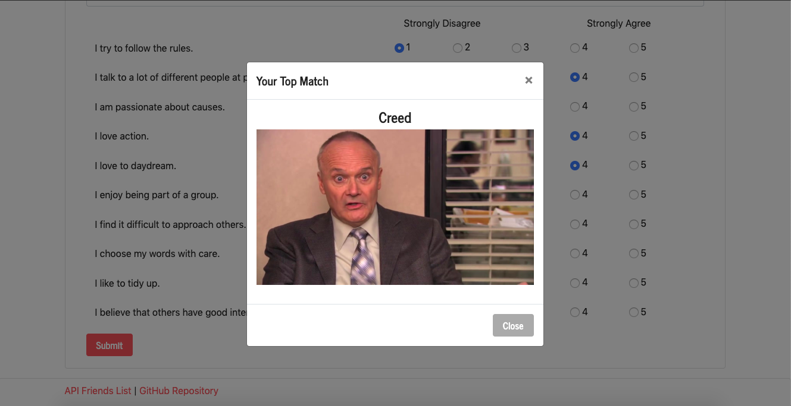

#  Friend Finder

Friend Finder is an app where a user answers a quiz and then, based on their responses, receive a new friend that best matches their personality. 

## HTML Routes

* The default route is the homepage. This page is just a title page with a link that directs the user to the survey.
* The survey page is where the user answers questions, posts them to the friendData API, and receives the results back from the API.

##  Data

There are two API routes for data to run the app:
* Friend Data: The user's results are added and run against to return their match.
* Questions: The personality questions which are called and dynamically appended to the form.

## Technologies

* JavaScript
* JQuery
* Node.js
* Express Node Module
* Path Node Module
* HTML5
* Bootstrap 4

### Created by Kelsi Hoyle

[Demo App on Heroku](https://young-falls-67340.herokuapp.com/)